# Examples

The following table gives an overview over all examples.

| Section                                                                                                   | Brief Description                                                  | File                                                               |
|-----------------------------------------------------------------------------------------------------------|--------------------------------------------------------------------|--------------------------------------------------------------------|
| [1. Arenstorf orbit](#1-arenstorf-orbit)                                                                  | This example shows how to use multiple adaptive time step methods  | [`arenstorf.cpp`](arenstorf.cpp)                                   |
| [2. Brownian movement](#2-brownian-movement)                                                              | This example shows how to use random in an ODE                     | [`brownian.cpp`](brownian.cpp)                                     |
| [3. Brusselator equations](#3-brusselator-equations)                                                      | The chemistry example of Brusselator (2 equations model)           | [`brusselator.cpp`](brusselator.cpp)                               |
| [4. Brusselator equations with DIRK method](#4-brusselator-equations-with-dirk-method)                    | This example shows hos to use DIRK methods                         | [`brusselator_dirk.cpp`](brusselator_dirk.cpp)                     |
| [5. Curtiss-Hirschfelder equation](#5-curtiss-hirschfelder-equation)                                      | This example shows how to use range and iterators on solution      | [`curtiss_hirschfelder.cpp`](curtiss_hirschfelder.cpp)             |
| [6. Curtiss-Hirschfelder equation with expRK method](#6-curtiss-hirschfelder-equation-with-exprk-method)  | This example shows how to use exponential Runge-Kutta methods      | [`curtiss_hirschfelder_exprk.cpp`](curtiss_hirschfelder_exprk.cpp) |
| [7. Exponential function](#7-exponential-function)                                                        | This example is the simplest example                               | [`exp.cpp`](exp.cpp)                                               |
| [8. Heat model](#8-heat-model)                                                                            | The classical heat equation solving with RKC2 method               | [`heat.cpp`](heat.cpp)                                             |
| [9. ROCK method](#9-rock-method)                                                                          | This example shows how to use ROCK2 and ROCK4 methods              | [`heat_rock.cpp`](heat_rock.cpp)                                   |
| [10. Samurai is hot](#10-samurai-is-hot)                                                                  | This example shows how to coupling ponio and samurai               | [`heat_samurai.cpp`](heat_samurai.cpp)                             |
| [11. Lorenz equations](#11-lorenz-equations)                                                              | The chaotic system example of Lorenz equations                     | [`lorenz.cpp`](lorenz.cpp)                                         |
| [12. Lorenz equations with multiple methods](#12-lorenz-equations-with-multiple-methods)                  | This example shows how to use splitting methods and Lawson methods | [`lorenz_tuto.cpp`](lorenz_tuto.cpp)                               |
| [13. Lotka-Volterra model](#13-lotka-volterra-model)                                                      | The classical predator–prey model of Lotka-Volterra                | [`lotka_volterra.cpp`](lotka_volterra.cpp)                         |
| [14. Nagumo equation](#14-nagumo-equation)                                                                | This example shows how to use ponio to mesure order of a method    | [`nagumo.cpp`](nagumo.cpp)                                         |
| [15. Pendulum equation](#15-pendulum-equation)                                                            | The classical pendulum equation                                    | [`pendulum.cpp`](pendulum.cpp)                                     |

To lunch examples, in the main directory of ponio run:

```
  cmake . -B build -DBUILD_DEMOS=ON
```

Eventually to get examples with samurai run:

```
  cmake . -B build -DBUILD_DEMOS=ON -DBUILD_SAMURAI_DEMOS=ON
```

and

```
  cd build
```

next you can compile an example with

```
  make AN_EXAMPLE
```

you could also launch the Python script which launch the example and display results

```
  make AN_EXAMPLE_visu
```

or

```
  make visu_AN_EXAMPLE
```

## 1. Arenstorf orbit

The system of differential equations for the Arenstorf orbit are:

$$
  \begin{cases}
    \ddot{x} &= x + 2\dot{y} - \frac{1-\mu}{r_1^3}(x+\mu) - \frac{\mu}{r_2^3}(x-1+\mu) \\
    \ddot{y} &= y - 2\dot{x} - \frac{1-\mu}{r_1^3}y - \frac{\mu}{r_2^3}y
  \end{cases}
$$

where

$$
  r_1 = \sqrt{(x+\mu)^2 + y^2},\quad r_2 = \sqrt{(x-1+\mu)^2 + y^2}
$$

parameter $\mu=0.012277471$ and the initial condition gives by:

$$
  x(0) = 0.994,\quad \dot{x}(0) = 0,\quad y(0) = 0,\quad \dot{y}(0) = -2.00158510637908252240537862224
$$

To solve this kind of problem with ponio, first of all you should rewrite it as the form: $\dot{u} = f(t, u)$, here we classically take

$$
  u = \begin{pmatrix}
    x \\
    y \\
    \dot{x} \\
    \dot{y}
  \end{pmatrix}
$$

So we have:

$$
  \dot{u} = \begin{pmatrix}
    \dot{x} \\
    \dot{y} \\
    \ddot{x} \\
    \ddot{y}
  \end{pmatrix} = \begin{pmatrix}
    \dot{x} \\
    \dot{y} \\
    x + 2\dot{y} - \frac{1-\mu}{r_1^3}(x+\mu) - \frac{\mu}{r_2^3}(x-1+\mu) \\
    y - 2\dot{x} - \frac{1-\mu}{r_1^3}y - \frac{\mu}{r_2^3}y
  \end{pmatrix} = f(t, u)
$$

In this example we solve this system with some explicit adaptive time step methods from [Dormand, J.R., Prince, P.J., A family of embedded Runge-Kutta formulae (1980) *Journal of Computational and Applied Mathematics*](http://dx.doi.org/10.1016/0771-050x(80)90013-3)

| Arenstorf orbit                                  | Arenstorf velocity                                  |
|--------------------------------------------------|-----------------------------------------------------|
| 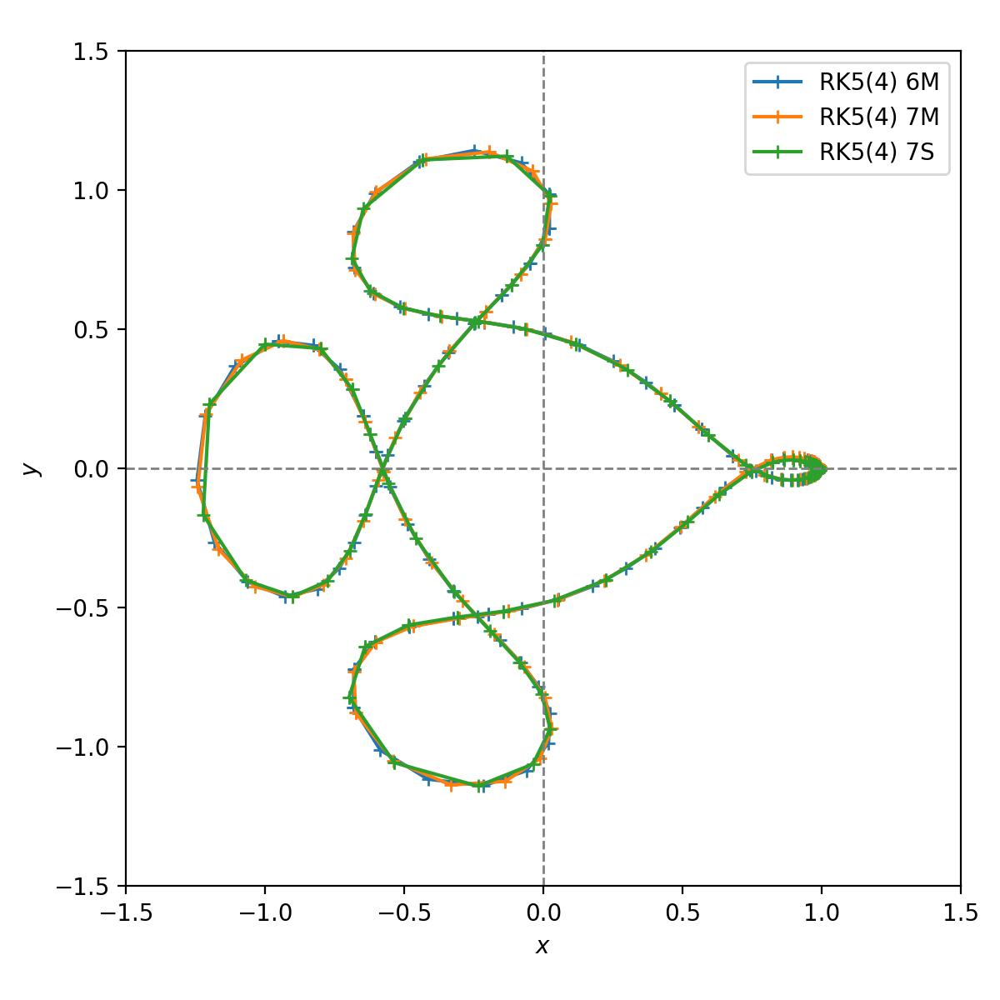 | 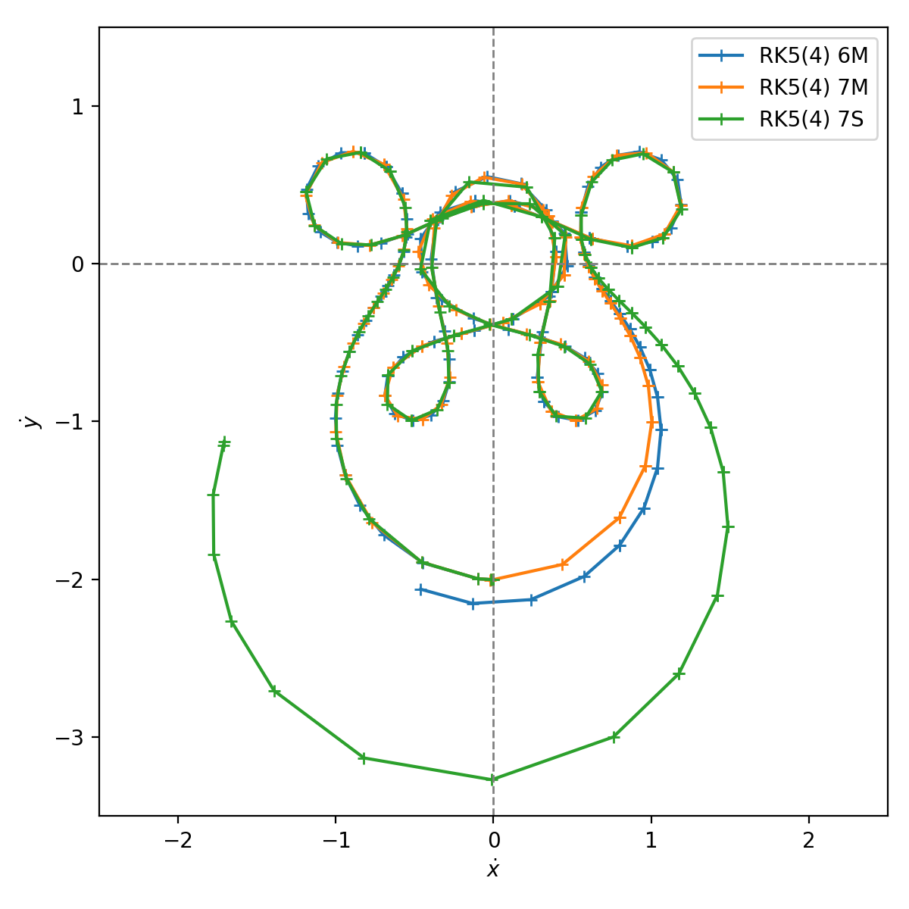 |

| Time step history                                  |
|----------------------------------------------------|
| 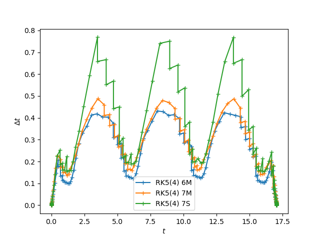 |

All example in [`arenstorf.cpp`](arenstorf.cpp), and run

```
  make arenstorf_visu
```

## 2. Brownian movement

We write a simple Brownian movement

$$
  \begin{cases}
    \dot{x} = X(t) \\
    \dot{y} = Y(t)
  \end{cases}
$$

where $X(t)$ and $Y(t)$ are random variable (juste a `std::rand` at each iteration).

| Some Brownian movement in 2D                         |
|------------------------------------------------------|
|  |

All example in [`brownian.cpp`](brownian.cpp), and run

```
  make brownian_visu
```

## 3. Brusselator equations

The Brusselator is a model of periodic chemical reaction. We present the version ODE with two species

$$
  \begin{cases}
    \dot{x} &= m_a - (m_b + 1)x + x^2y \\
    \dot{y} &= m_b x - x^2y
  \end{cases}
$$

We solve this model with a hight order explicit Runge-Kutta method: RK(8, 6).

| Brusselator concentration                                        | Brusselator concentration in phase space                                        |
|------------------------------------------------------------------|---------------------------------------------------------------------------------|
|  |  |

All example in [`brusselator.cpp`](brusselator.cpp), and run

```
  make brusselator_visu
```

## 4. Brusselator equations with DIRK method

The Brusselator is a model of periodic chemical reaction. We present the version ODE with two species

$$
  \begin{cases}
    \dot{x} &= m_a - (m_b + 1)x + x^2y \\
    \dot{y} &= m_b x - x^2y
  \end{cases}
$$

In this example we choose to solve the model with a diagonal-implicit Runge-Kutta method. The problem object has to be an `ponio::implicit_problem` and we need to compute the Jacobian matrix and proposes some linear algebra routines. For that we use [Eigen library](http://eigen.tuxfamily.org/).

If `state_t` is floating point, a Eigen vector or a samurai field, ponio provides functions to solve implicit problems. In all cases, you can specify your own linear algebra object that contains a `solver` method (see `lin_alg_2_2` structure), that takes a matrix $A$ (same type as the returns type of jacobian gives to `ponio::implicit_problem`) and a vector $b$ (same type as `state_t`) and return the solution of the linear problem

$$
  Ax = b.
$$

| Brusselator concentration                                                         | Brusselator concentration in phase space                                                         |
|-----------------------------------------------------------------------------------|--------------------------------------------------------------------------------------------------|
| 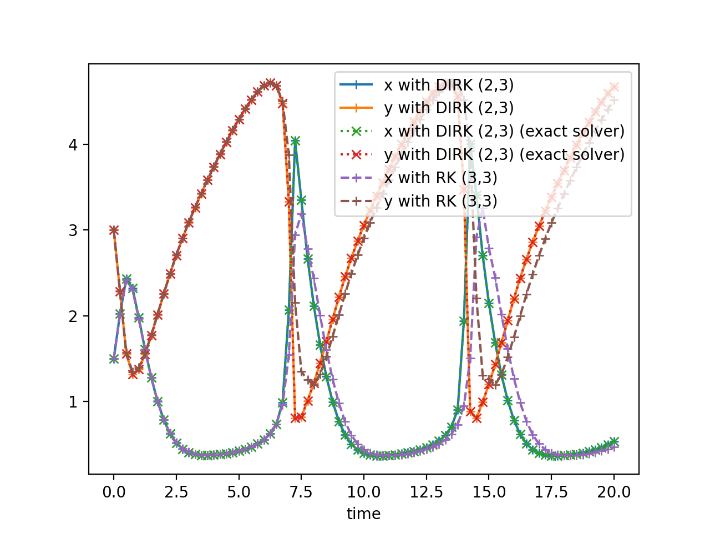 |  |

All example in [`brusselator_dirk.cpp`](brusselator_dirk.cpp), and run

```
  make brusselator_dirk_visu
```

## 5. Curtiss-Hirschfelder equation

A classical stiff problem is the Curtiss-Hirschfelder equation

$$
  \dot{y} = k(\cos(t) - y)
$$

with $k>1$ and $y(0) = y_0$. We choose $k = 50$ and $y_0 = 2$.

In this example we present how to control time loop with a `ponio::solver_range`. You can do it with an iterator on this range with :

```cpp
  auto sol_range = ponio::make_solver_range( ... );
```

and iterate over this range with a classical iterator with:

```cpp
  for ( auto it = sol_range.begin(); it < sol_range.end(); ++it )
  {
    // ...
    // current time : it->time
    // current state : it->state
    // current time step : it->time_step
  }
```

or with a range-based for loop:

```cpp
  for ( auto ui : sol_range )
  {
    // ...
  }
```

Only in the first case you can control time step before increment (with your adaptive time step heuristic) with modification of `it->time_step` data member.

| Curtiss-Hirschfelder solution                                                |
|------------------------------------------------------------------------------|
| 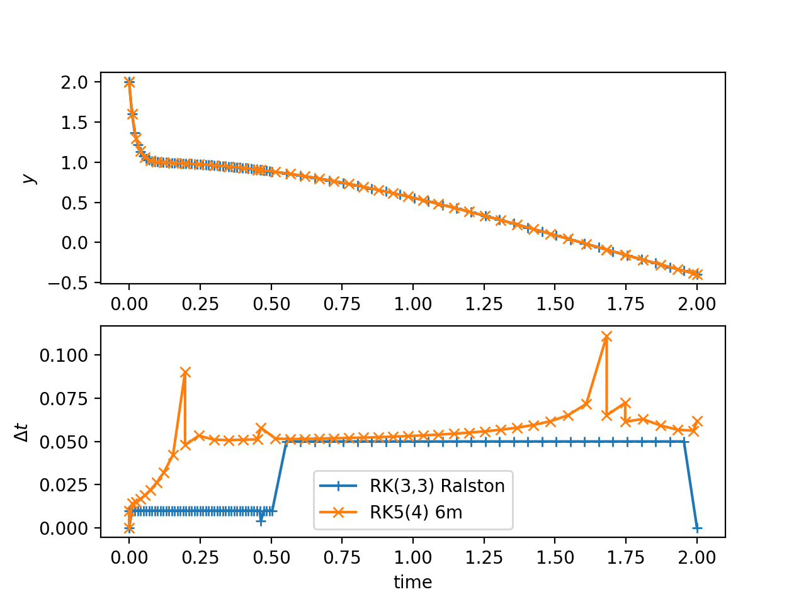 |

All example in [`curtiss_hirschfelder.cpp`](curtiss_hirschfelder.cpp), and run

```
  make curtiss_hirschfelder_visu
```

## 6. Curtiss-Hirschfelder equation with expRK method

A classical stiff problem is the Curtiss-Hirschfelder equation

$$
  \dot{y} = k(\cos(t) - y)
$$

with $k>1$ and $y(0) = y_0$. We choose $k = 50$ and $y_0 = 2$.

In this example we solve the equation with Krogstad method (an exponential Runge-Kutta method), and LRK(4, 4) method (a Lawson method). In both methods, you need to define a `ponio::lawson_problem` with a linear and non-linear part. We choose the linear part $-k$ and the non-linear part as $N:t, y\mapsto k\cos(t)$. Exponential Runge-Kutta methods and Lawson methods are build to solve exactly the linear part when the non-linear part goes to 0.

| Curtiss-Hirschfelder solution                                                                  |
|------------------------------------------------------------------------------------------------|
| 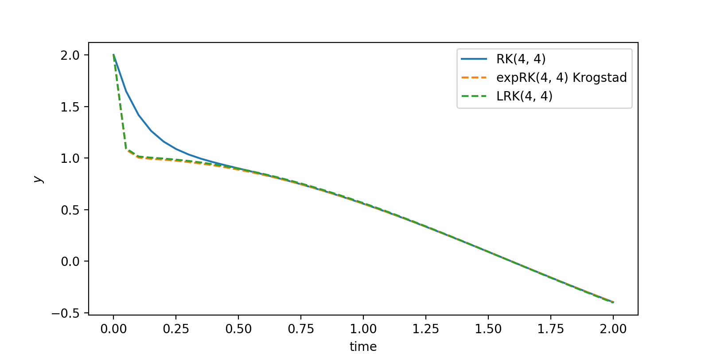 |

All example in [`curtiss_hirschfelder_exprk.cpp`](curtiss_hirschfelder_exprk.cpp), and run

```
  make curtiss_hirschfelder_exprk_visu
```

## 7. Exponential function

In this example we solve the simplest differential equation:

$$
  \dot{y} = y
$$

with $y(0) = 1$. After a lot of calculus we can find the exact solution $y(t) = e^t$, or we can approximate it with RK NSSP (2, 1) method.

| Exponential function                                       |
|------------------------------------------------------------|
| 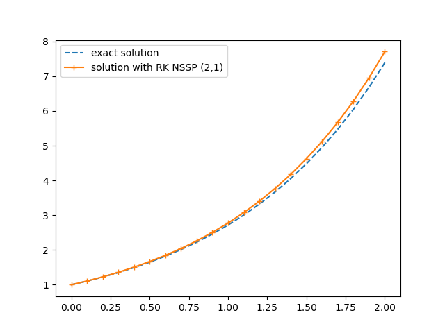 |

All example in [`exp.cpp`](exp.cpp), and run

```
  make exp_visu
```

## 8. Heat model

In this example we propose to solve a PDE, the heat equation in 1D

$$
  \partial_t u = -\partial_{xx} u
$$

with the initial condition gives by the fundamental solution of head equation at time $t=0.001$ given by:

$$
  u(t, x) = \frac{1}{2\sqrt{\pi t}} e^{-\frac{x^2}{4t}}
$$

In ponio, the `state_t` should propose arithmetic operations as addition and multiplication by a scalar (of type `value_t`). For the sake of simplicity, we use in the example a `std::valarray<double>`.

The heat equation is quite complicated to solve with an explicit Runge-Kutta method but we do it with a extended stability method with the Runge-Kutta Chebyshev of order 2. In ponio you could choose the number of stages of this method : `ponio::runge_kutta::explicit_rkc2<15>()` (for 15 stages).

| Solution of heat equation                             |
|-------------------------------------------------------|
|  |

All example in [`heat.cpp`](heat.cpp), and run

```
  make heat_visu
```

## 9. ROCK method

In this example we propose to solve a PDE, the heat equation in 1D

$$
  \partial_t u = -\partial_{xx} u
$$

with the initial condition gives by the fundamental solution of head equation at time $t=0.001$ given by:

$$
  u(t, x) = \frac{1}{2\sqrt{\pi t}} e^{-\frac{x^2}{4t}}
$$

In ponio, the `state_t` should propose arithmetic operations as addition and multiplication by a scalar (of type `value_t`). For the sake of simplicity, we use in the example a `std::valarray<double>`.

An optimization of RKC2 is the ROCK2 method from [Abdulle, A., Medovikov, A. Second order Chebyshev methods based on orthogonal polynomials. *Numer. Math* (2001)](https://doi.org/10.1007/s002110100292), and its extension to order 4, ROCK4 method presented in [Abdulle, A. Fourth Order Chebyshev Methods with Recurrence Relation. *SIAM Journal on Scientific Computing* (2002)](https://doi.org/10.1137/S106482750037954).

| Solution of heat equation                              | Mesure of order of ROCK2 and ROCK4           |
|--------------------------------------------------------|----------------------------------------------|
|  |  |

All example in [`heat_rock.cpp`](heat_rock.cpp), and run

```
  make heat_rock_visu
```

## 10. Samurai is hot

In this example we propose to solve a PDE, the heat equation in 1D

$$
  \partial_t u = -\partial_{xx} u
$$

with the initial condition gives by the fundamental solution of head equation at time $t=0.001$ given by:

$$
  u(t, x) = \frac{1}{2\sqrt{\pi t}} e^{-\frac{x^2}{4t}}
$$


All example in [`heat_samurai.cpp`](heat_samurai.cpp), and run

```
  make heat_samurai_visu
```

## 11. Lorenz equations

$$
  \begin{cases}
    \dot{x} &= \sigma (y - x) \\
    \dot{y} &= \rho x - y - xz \\
    \dot{z} &= xy - \beta z
  \end{cases}
$$

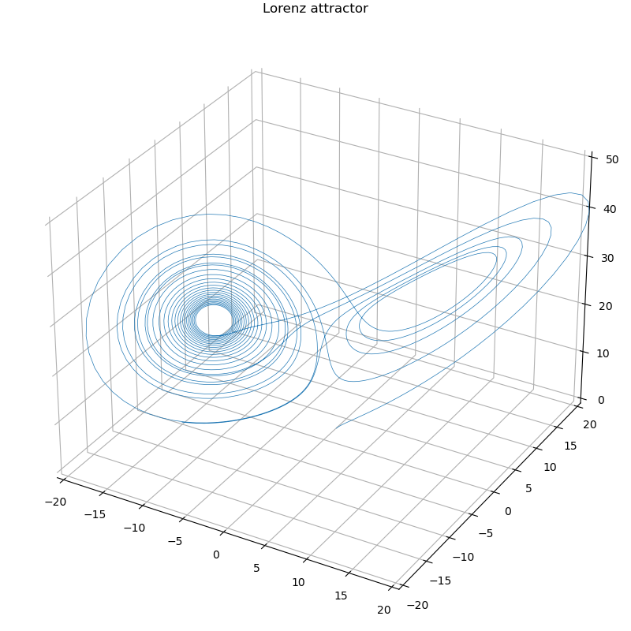

All example in [`lorenz.cpp`](lorenz.cpp), and run

```
  make lorenz_visu
```

## 12. Lorenz equations with multiple methods

$$
  \begin{cases}
    \dot{x} &= \sigma (y - x) \\
    \dot{y} &= \rho x - y - xz \\
    \dot{z} &= xy - \beta z
  \end{cases}
$$

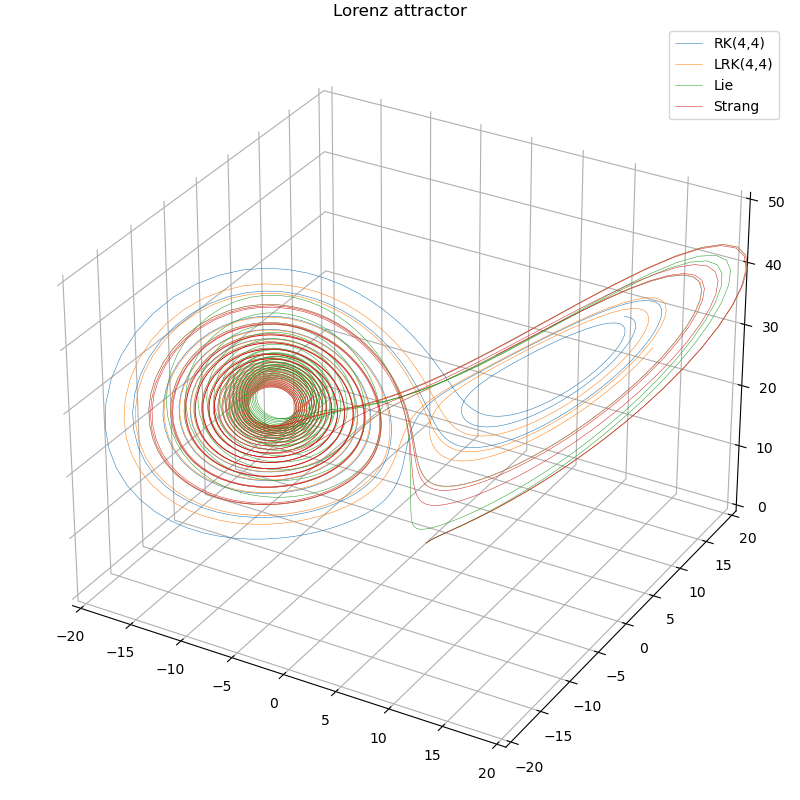

All example in [`lorenz_tuto.cpp`](lorenz_tuto.cpp), and run

```
  make lorenz_tuto_visu
```

## 13. Lotka-Volterra model

$$
  \begin{cases}
    \dot{x} = \alpha x - \beta xy \\
    \dot{y} = \delta xy - \gamma y
  \end{cases}
$$

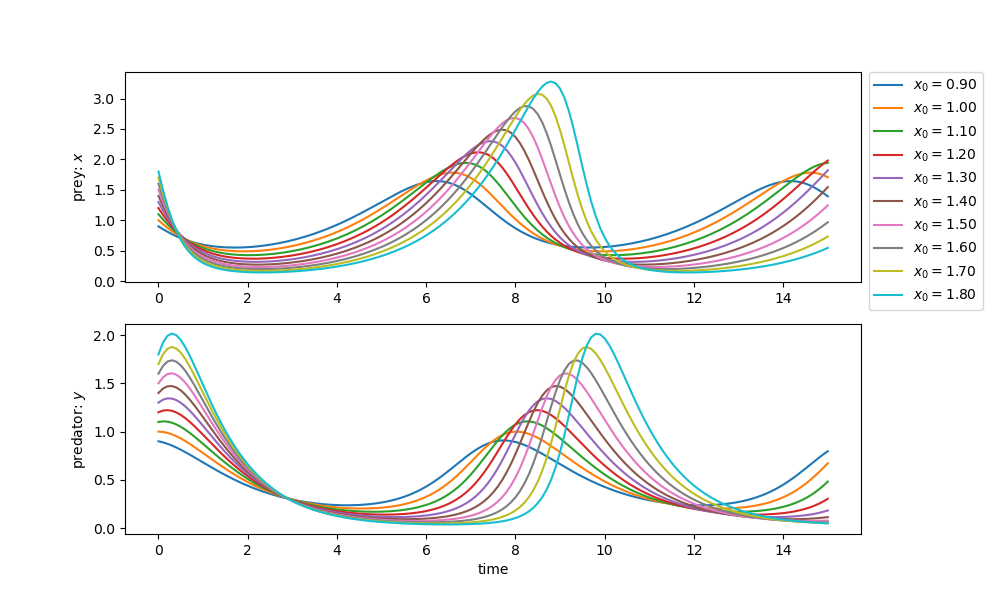

All example in [`lotka_volterra.cpp`](lotka_volterra.cpp), and run

```
  make lotka_volterra_visu
```

## 14. Nagumo equation

$$
  \partial_t u = d \partial_{xx}u + ku^2(1-u)
$$

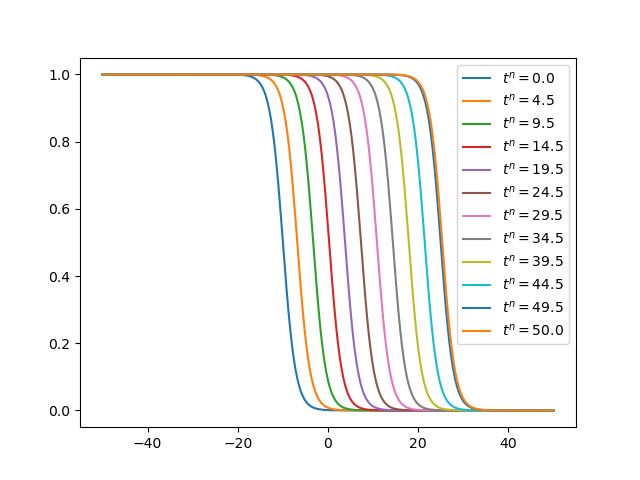

All example in [`nagumo.cpp`](nagumo.cpp), and run

```
  make nagumo_visu
```

## 15. Pendulum equation

$$
  \ddot{\theta} + b\dot{\theta} + c\sin(\theta) = 0
$$

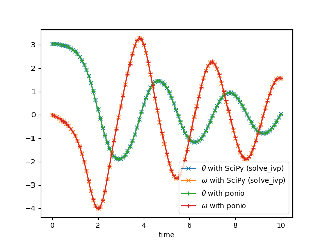

All example in [`pendulum.cpp`](pendulum.cpp), and run

```
  make pendulum_visu
```
