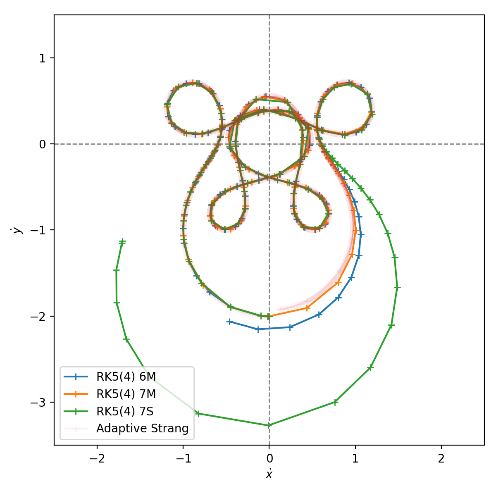
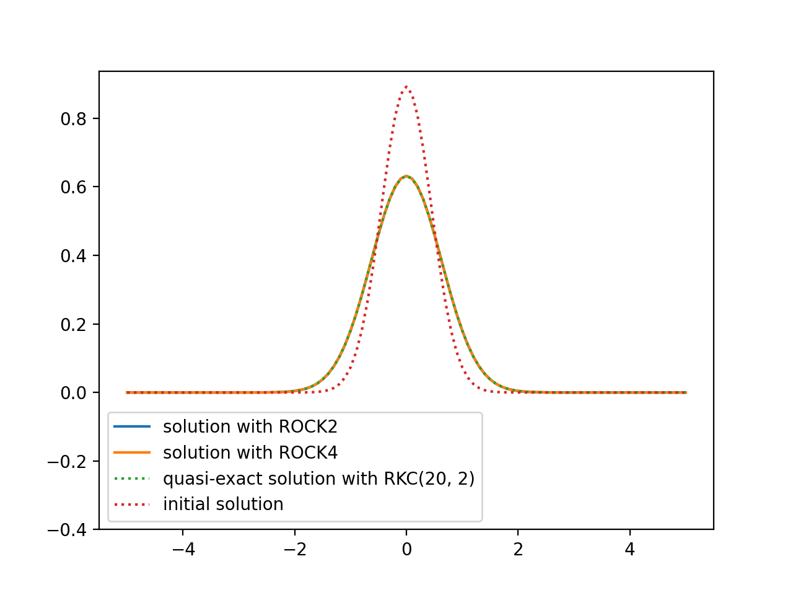
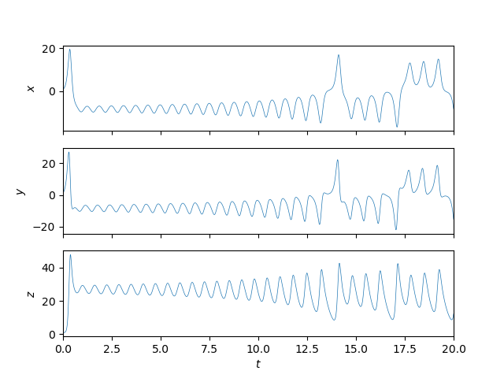
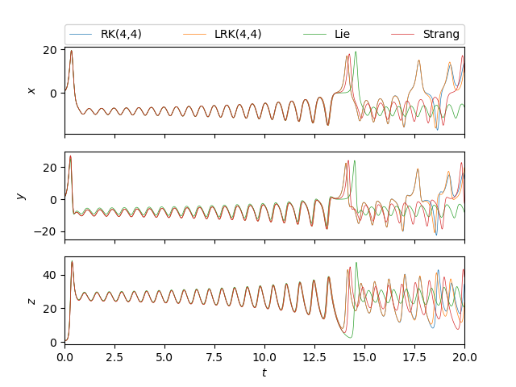

# Examples

The following table gives an overview over all examples.

| Section                                                                                             | Brief Description                                                  | File                                                                                                                         |
|-----------------------------------------------------------------------------------------------------|--------------------------------------------------------------------|------------------------------------------------------------------------------------------------------------------------------|
| [Arenstorf orbit](#arenstorf-orbit)                                                                 | This example shows how to use multiple adaptive time step methods  | [arenstorf.cpp](https://github.com/hpc-maths/ponio/blob/main/ponio/examples/arenstorf.cpp)                                   |
| [Brownian movement](#brownian-movement)                                                             | This example shows how to use random in an ODE                     | [brownian.cpp](https://github.com/hpc-maths/ponio/blob/main/ponio/examples/brownian.cpp)                                     |
| [Brusselator equations](#brusselator-equations)                                                     | The chemistry example of Brusselator (2 equations model)           | [brusselator.cpp](https://github.com/hpc-maths/ponio/blob/main/ponio/examples/brusselator.cpp)                               |
| [Brusselator equations with DIRK method](#brusselator-equations-with-dirk-method)                   | This example shows hos to use DIRK methods                         | [brusselator_dirk.cpp](https://github.com/hpc-maths/ponio/blob/main/ponio/examples/brusselator_dirk.cpp)                     |
| [Curtiss-Hirschfelder equation](#curtiss-hirschfelder-equation)                                     | This example shows how to use range and iterators on solution      | [curtiss_hirschfelder.cpp](https://github.com/hpc-maths/ponio/blob/main/ponio/examples/curtiss_hirschfelder.cpp)             |
| [Curtiss-Hirschfelder equation with expRK method](#curtiss-hirschfelder-equation-with-exprk-method) | This example shows how to use exponential Runge-Kutta methods      | [curtiss_hirschfelder_exprk.cpp](https://github.com/hpc-maths/ponio/blob/main/ponio/examples/curtiss_hirschfelder_exprk.cpp) |
| [Exponential function](#exponential-function)                                                       | This example is the simplest example                               | [exp.cpp](https://github.com/hpc-maths/ponio/blob/main/ponio/examples/exp.cpp)                                               |
| [Heat model](#heat-model)                                                                           | The classical heat equation solving with RKC2 method               | [heat.cpp](https://github.com/hpc-maths/ponio/blob/main/ponio/examples/heat.cpp)                                             |
| [ROCK method](#rock-method)                                                                         | This example shows how to use ROCK2 and ROCK4 methods              | [heat_rock.cpp](https://github.com/hpc-maths/ponio/blob/main/ponio/examples/heat_rock.cpp)                                   |
| [Samurai is hot](#samurai-is-hot)                                                                   | This example shows how to coupling ponio and samurai               | [heat_samurai.cpp](https://github.com/hpc-maths/ponio/blob/main/ponio/examples/heat_samurai.cpp)                             |
| [Lorenz equations](#lorenz-equations)                                                               | The chaotic system example of Lorenz equations                     | [lorenz.cpp](https://github.com/hpc-maths/ponio/blob/main/ponio/examples/lorenz.cpp)                                         |
| [Lorenz equations with multiple methods](#lorenz-equations-with-multiple-methods)                   | This example shows how to use splitting methods and Lawson methods | [lorenz_tuto.cpp](https://github.com/hpc-maths/ponio/blob/main/ponio/examples/lorenz_tuto.cpp)                               |
| [Lorenz equations with all methods](#lorenz-equations-with-all-methods)                             | This example shows how to use all methods (except expRK)           | [lorenz_all.cpp](https://github.com/hpc-maths/ponio/blob/main/ponio/examples/lorenz_all.cpp)                                 |
| [Lotka-Volterra model](#lotka-volterra-model)                                                       | The classical predator–prey model of Lotka-Volterra                | [lotka_volterra.cpp](https://github.com/hpc-maths/ponio/blob/main/ponio/examples/lotka_volterra.cpp)                         |
| [Nagumo equation](#nagumo-equation)                                                                 | Example of a traveling wave                                        | [nagumo.cpp](https://github.com/hpc-maths/ponio/blob/main/ponio/examples/nagumo.cpp)                                         |
| [Pendulum equation](#pendulum-equation)                                                             | The classical pendulum equation                                    | [pendulum.cpp](https://github.com/hpc-maths/ponio/blob/main/ponio/examples/pendulum.cpp)                                     |
| [Belousov Zhabotinsky](#belousov-zhabotinsky)                                                       | Solves Belousov-Zhabotinsky equations with PIROCK method           | [belousov_zhabotinsky_pirock.cpp](belousov_zhabotinsky_pirock.cpp)                                                           |

To lunch examples, in the main directory of ponio run:

```
  cmake . -B build -DBUILD_DEMOS=ON
```

Eventually to get examples with samurai run:

```
  cmake . -B build -DBUILD_DEMOS=ON -DBUILD_SAMURAI_DEMOS=ON
```

and

```
  cd build
```

next you can compile an example with

```
  make AN_EXAMPLE
```

you could also launch the Python script which launch the example and display results

```
  make AN_EXAMPLE_visu
```

or

```
  make visu_AN_EXAMPLE
```

## Arenstorf orbit

The system of differential equations for the Arenstorf orbit are:

$$
  \begin{cases}
    \ddot{x} &= x + 2\dot{y} - \frac{1-\mu}{r_1^3}(x+\mu) - \frac{\mu}{r_2^3}(x-1+\mu) \\
    \ddot{y} &= y - 2\dot{x} - \frac{1-\mu}{r_1^3}y - \frac{\mu}{r_2^3}y
  \end{cases}
$$

where

$$
  r_1 = \sqrt{(x+\mu)^2 + y^2},\quad r_2 = \sqrt{(x-1+\mu)^2 + y^2}
$$

parameter $\mu=0.012277471$ and the initial condition gives by:

$$
  x(0) = 0.994,\quad \dot{x}(0) = 0,\quad y(0) = 0,\quad \dot{y}(0) = -2.00158510637908252240537862224
$$

To solve this kind of problem with ponio, first of all you should rewrite it as the form: $\dot{u} = f(t, u)$, here we classically take

$$
  u = \begin{pmatrix}
    x \\
    y \\
    \dot{x} \\
    \dot{y}
  \end{pmatrix}
$$

So we have:

$$
  \dot{u} = \begin{pmatrix}
    \dot{x} \\
    \dot{y} \\
    \ddot{x} \\
    \ddot{y}
  \end{pmatrix} = \begin{pmatrix}
    \dot{x} \\
    \dot{y} \\
    x + 2\dot{y} - \frac{1-\mu}{r_1^3}(x+\mu) - \frac{\mu}{r_2^3}(x-1+\mu) \\
    y - 2\dot{x} - \frac{1-\mu}{r_1^3}y - \frac{\mu}{r_2^3}y
  \end{pmatrix} = f(t, u)
$$

In this example we solve this system with some explicit adaptive time step methods from [Dormand, J.R., Prince, P.J., A family of embedded Runge-Kutta formulae (1980) *Journal of Computational and Applied Mathematics*](http://dx.doi.org/10.1016/0771-050x(80)90013-3)

| Arenstorf orbit                          | Arenstorf velocity                          |
|------------------------------------------|---------------------------------------------|
|  |  |

| Time step history                          |
|--------------------------------------------|
|  |

All example in [arenstorf.cpp](https://github.com/hpc-maths/ponio/blob/main/ponio/examples/arenstorf.cpp), and run

```
  make arenstorf_visu
```

## Brownian movement

We write a simple Brownian movement

$$
  \begin{cases}
    \dot{x} = X(t) \\
    \dot{y} = Y(t)
  \end{cases}
$$

where $X(t)$ and $Y(t)$ are random variable (juste a `std::rand` at each iteration).

| Some Brownian movement in 2D              |
|-------------------------------------------|
|  |

All example in [brownian.cpp](https://github.com/hpc-maths/ponio/blob/main/ponio/examples/brownian.cpp), and run

```
  make brownian_visu
```

## Brusselator equations

The Brusselator is a model of periodic chemical reaction. We present the version ODE with two species

$$
  \begin{cases}
    \dot{x} &= m_a - (m_b + 1)x + x^2y \\
    \dot{y} &= m_b x - x^2y
  \end{cases}
$$

We solve this model with a hight order explicit Runge-Kutta method: RK(8, 6).

| Brusselator concentration                            | Brusselator concentration in phase space                            |
|------------------------------------------------------|---------------------------------------------------------------------|
|  |  |

All example in [brusselator.cpp](https://github.com/hpc-maths/ponio/blob/main/ponio/examples/brusselator.cpp), and run

```
  make brusselator_visu
```

## Brusselator equations with DIRK method

The Brusselator is a model of periodic chemical reaction. We present the version ODE with two species

$$
  \begin{cases}
    \dot{x} &= m_a - (m_b + 1)x + x^2y \\
    \dot{y} &= m_b x - x^2y
  \end{cases}
$$

In this example we choose to solve the model with a diagonal-implicit Runge-Kutta method. The problem object has to be an `ponio::implicit_problem` and we need to compute the Jacobian matrix and proposes some linear algebra routines. For that we use [Eigen library](http://eigen.tuxfamily.org/).

If `state_t` is floating point, a Eigen vector or a samurai field, ponio provides functions to solve implicit problems. In all cases, you can specify your own linear algebra object that contains a `solver` method (see `lin_alg_2_2` structure), that takes a matrix $A$ (same type as the returns type of jacobian gives to `ponio::implicit_problem`) and a vector $b$ (same type as `state_t`) and return the solution of the linear problem

$$
  Ax = b.
$$

| Brusselator concentration                                 | Brusselator concentration in phase space                                 |
|-----------------------------------------------------------|--------------------------------------------------------------------------|
|  |  |

All example in [brusselator_dirk.cpp](https://github.com/hpc-maths/ponio/blob/main/ponio/examples/brusselator_dirk.cpp), and run

```
  make brusselator_dirk_visu
```

## Curtiss-Hirschfelder equation

A classical stiff problem is the Curtiss-Hirschfelder equation

$$
  \dot{y} = k(\cos(t) - y)
$$

with $k>1$ and $y(0) = y_0$. We choose $k = 50$ and $y_0 = 2$.

In this example we present how to control time loop with a `ponio::solver_range`. You can do it with an iterator on this range with :

```cpp
  auto sol_range = ponio::make_solver_range( ... );
```

and iterate over this range with a classical iterator with:

```cpp
  for ( auto it = sol_range.begin(); it < sol_range.end(); ++it )
  {
    // ...
    // current time : it->time
    // current state : it->state
    // current time step : it->time_step
  }
```

or with a range-based for loop:

```cpp
  for ( auto ui : sol_range )
  {
    // ...
  }
```

Only in the first case you can control time step before increment (with your adaptive time step heuristic) with modification of `it->time_step` data member.

| Curtiss-Hirschfelder solution                                     |
|-------------------------------------------------------------------|
|  |

All example in [curtiss_hirschfelder.cpp](https://github.com/hpc-maths/ponio/blob/main/ponio/examples/curtiss_hirschfelder.cpp), and run

```
  make curtiss_hirschfelder_visu
```

## Curtiss-Hirschfelder equation with expRK method

A classical stiff problem is the Curtiss-Hirschfelder equation

$$
  \dot{y} = k(\cos(t) - y)
$$

with $k>1$ and $y(0) = y_0$. We choose $k = 50$ and $y_0 = 2$.

In this example we solve the equation with Krogstad method (an exponential Runge-Kutta method), and LRK(4, 4) method (a Lawson method). In both methods, you need to define a `ponio::lawson_problem` with a linear and non-linear part. We choose the linear part $-k$ and the non-linear part as $N:t, y\mapsto k\cos(t)$. Exponential Runge-Kutta methods and Lawson methods are build to solve exactly the linear part when the non-linear part goes to 0.

| Curtiss-Hirschfelder solution                                           |
|-------------------------------------------------------------------------|
|  |

All example in [curtiss_hirschfelder_exprk.cpp](https://github.com/hpc-maths/ponio/blob/main/ponio/examples/curtiss_hirschfelder_exprk.cpp), and run

```
  make curtiss_hirschfelder_exprk_visu
```

## Exponential function

In this example we solve the simplest differential equation:

$$
  \dot{y} = y
$$

with $y(0) = 1$. After a lot of calculus we can find the exact solution $y(t) = e^t$, or we can approximate it with RK NSSP (2, 1) method.

| Exponential function                    |
|-----------------------------------------|
|  |

All example in [exp.cpp](https://github.com/hpc-maths/ponio/blob/main/ponio/examples/exp.cpp), and run

```
  make exp_visu
```

## Heat model

In this example we propose to solve a PDE, the heat equation in 1D

$$
  \partial_t u = -\partial_{xx} u
$$

with the initial condition gives by the fundamental solution of head equation at time $t=0.001$ given by:

$$
  u(t, x) = \frac{1}{2\sqrt{\pi t}} e^{-\frac{x^2}{4t}}
$$

In ponio, the `state_t` should propose arithmetic operations as addition and multiplication by a scalar (of type `value_t`). For the sake of simplicity, we use in the example a `std::valarray<double>`.

The heat equation is quite complicated to solve with an explicit Runge-Kutta method but we do it with a extended stability method with the Runge-Kutta Chebyshev of order 2. In ponio you could choose the number of stages of this method : `ponio::runge_kutta::explicit_rkc2<15>()` (for 15 stages).

| Solution of heat equation                     |
|-----------------------------------------------|
|  |

All example in [heat.cpp](https://github.com/hpc-maths/ponio/blob/main/ponio/examples/heat.cpp), and run

```
  make heat_visu
```

## ROCK method

In this example we propose to solve a PDE, the heat equation in 1D

$$
  \partial_t u = -\partial_{xx} u
$$

with the initial condition gives by the fundamental solution of head equation at time $t=0.001$ given by:

$$
  u(t, x) = \frac{1}{2\sqrt{\pi t}} e^{-\frac{x^2}{4t}}
$$

In ponio, the `state_t` should propose arithmetic operations as addition and multiplication by a scalar (of type `value_t`). For the sake of simplicity, we use in the example a `std::valarray<double>`.

An optimization of RKC2 is the ROCK2 method from [Abdulle, A., Medovikov, A. Second order Chebyshev methods based on orthogonal polynomials. *Numer. Math* (2001)](https://doi.org/10.1007/s002110100292), and its extension to order 4, ROCK4 method presented in [Abdulle, A. Fourth Order Chebyshev Methods with Recurrence Relation. *SIAM Journal on Scientific Computing* (2002)](https://doi.org/10.1137/S106482750037954).

| Solution of heat equation                          | Mesure of order of ROCK2 and ROCK4       |
|----------------------------------------------------|------------------------------------------|
|  |  |

All example in [heat_rock.cpp](https://github.com/hpc-maths/ponio/blob/main/ponio/examples/heat_rock.cpp), and run

```
  make heat_rock_visu
```

## Samurai is hot

> This example needs to activate `-DBUILD_SAMURAI_DEMOS=ON`

In this example we propose to solve a PDE, the heat equation in 1D

$$
  \partial_t u = -\partial_{xx} u
$$

with the initial condition gives by the fundamental solution of head equation at time $t=0.001$ given by:

$$
  u(t, x) = \frac{1}{2\sqrt{\pi t}} e^{-\frac{x^2}{4t}}
$$

In this example we coupling the mesh refinement library [samurai](https://github.com/hpc-maths/samurai) with ponio.


| Solution of heat equation with levels of adaptive mesh |
|--------------------------------------------------------|
|   |

All example in [heat_samurai.cpp](https://github.com/hpc-maths/ponio/blob/main/ponio/examples/heat_samurai.cpp), and run

```
  make heat_samurai_visu
```

## Lorenz equations

The classical chaotic system example of Lorenz equations

$$
  \begin{cases}
    \dot{x} &= \sigma (y - x) \\
    \dot{y} &= \rho x - y - xz \\
    \dot{z} &= xy - \beta z
  \end{cases}
$$

| Solution in 3D                       | Solution by composant                       |
|--------------------------------------|---------------------------------------------|
|  |  |

All example in [lorenz.cpp](https://github.com/hpc-maths/ponio/blob/main/ponio/examples/lorenz.cpp), and run

```
  make lorenz_visu
```

## Lorenz equations with multiple methods

The classical chaotic system example of Lorenz equations

$$
  \begin{cases}
    \dot{x} &= \sigma (y - x) \\
    \dot{y} &= \rho x - y - xz \\
    \dot{z} &= xy - \beta z
  \end{cases}
$$

| Solution in 3D                            | Solution by composant                            |
|-------------------------------------------|--------------------------------------------------|
|  |  |

All example in [lorenz_tuto.cpp](https://github.com/hpc-maths/ponio/blob/main/ponio/examples/lorenz_tuto.cpp), and run

```
  make lorenz_tuto_visu
```

## Lorenz equations with all methods

The classical chaotic system example of Lorenz equations

$$
  \begin{cases}
    \dot{x} &= \sigma (y - x) \\
    \dot{y} &= \rho x - y - xz \\
    \dot{z} &= xy - \beta z
  \end{cases}
$$

| Solution in 3D                           |
|------------------------------------------|
|  |

All example in [lorenz_all.cpp](https://github.com/hpc-maths/ponio/blob/main/ponio/examples/lorenz_all.cpp), and run

```
  make lorenz_all_visu
```

## Lotka-Volterra model

The classical predator–prey model of Lotka-Volterra:

$$
  \begin{cases}
    \dot{x} = \alpha x - \beta xy \\
    \dot{y} = \delta xy - \gamma y
  \end{cases}
$$

with parameters $\alpha=\frac{2}{3}$, $\beta=\frac{4}{3}$, $\gamma = \delta = 1$, and with the initial condition $(x, y) = (x_0, x_0)$, with different values of $x_0$.

| Prey predator history                               | Solution in phase space                               |
|-----------------------------------------------------|-------------------------------------------------------|
|  |  |

All example in [lotka_volterra.cpp](https://github.com/hpc-maths/ponio/blob/main/ponio/examples/lotka_volterra.cpp), and run

```
  make lotka_volterra_visu
```

## Nagumo equation

The Nagumo equation is a propagation of a traveling wave

$$
  \partial_t u = d \partial_{xx}u + ku^2(1-u)
$$

with parameter $k=1$, $d=1$, with the initial solution given by exact solution to time $t=0$:

$$
  u(t, x) = \frac{\exp(c(x - x_0 - vt))}{1 + \exp(c(x-x_0 - vt))}
$$

where

$$
  v = \frac{1}{\sqrt{2}}\sqrt{kd},\quad c = -\frac{1}{\sqrt{2}}\sqrt{\frac{k}{d}},\quad x_0 = -10.
$$


| Solution with RKC(20, 2)              | Absolute error                       |
|---------------------------------------|--------------------------------------|
|  |  |

All example in [nagumo.cpp](https://github.com/hpc-maths/ponio/blob/main/ponio/examples/nagumo.cpp), and run

```
  make nagumo_visu
```

## Pendulum equation

The second order differential equation for the angle $\theta$ of a pendulum acted on by gravity with friction can be written:

$$
  \ddot{\theta} + b\dot{\theta} + c\sin(\theta) = 0
$$

where $b$ and $c$ are positive constants, we take $b=0.25$, $c=5.0$. As [Arenstorf orbit](#arenstorf-orbit), we have to rewrite problem as $\dot{u} = f(t, u)$ :

$$
  \partial_t \begin{pmatrix}
    \theta \\
    \omega
  \end{pmatrix} = \begin{pmatrix}
    \omega \\
    -b\omega - c\sin(\theta)
  \end{pmatrix}
$$

| Pendulum equation (solved with RK (4,4))                         |
|------------------------------------------------------------------|
|  |

All example in [pendulum.cpp](https://github.com/hpc-maths/ponio/blob/main/ponio/examples/pendulum.cpp), and run

```
  make pendulum_visu
```

# Belousov Zhabotinsky

> This example needs to activate `-DBUILD_SAMURAI_DEMOS=ON`

The Belousov Zhabotinsky reaction is a chemical periodic reaction, in this example we look at a 1D reduction model given by

$$
  \begin{cases}
    \partial_t a &= D_a \partial_{xx}a + \frac{1}{\mu}(-qa -ab + fc) \\
    \partial_t b &= D_b \partial_{xx}b + \frac{1}{\epsilon}(qa - ab + b(1-b)) \\
    \partial_t c &= D_c \partial_{xx}c + b -c \\
  \end{cases}
$$

with parameter

$$
  \epsilon = 10^{-3},\quad \mu = 10^{-5},\quad f=3,\quad q = 2\cdot 10^{-4}
$$

and diffusion coefficients

$$
  D_a = \frac{1}{400},\quad D_b = \frac{1}{400},\quad D_c = \frac{0.6}{400}
$$

In this example we coupling the mesh refinement library [samurai](https://github.com/hpc-maths/samurai) with ponio, and the system is solved by PIROCK method.

| Belousov Zhabotinsky system solved by PIROCK method                                            |
|------------------------------------------------------------------------------------------------|
|  |

All example in [`belousov_zhabotinsky_pirock.cpp`](belousov_zhabotinsky_pirock.cpp), and run

```
  make belousov_zhabotinsky_pirock_visu
```
